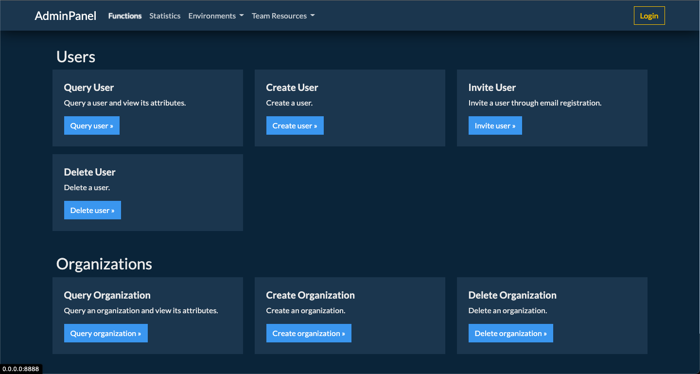

# FastAPI-Unpoly-OAuth

A demo project for trying out Unpoly, and also OAuth authentication in FastAPI. It's an admin interface. Currently incomplete, much TODO.

# Stack
- FastAPI
- Jinja2
- Bootstrap 5
- UnpolyJS
- Docker for packaging
---

